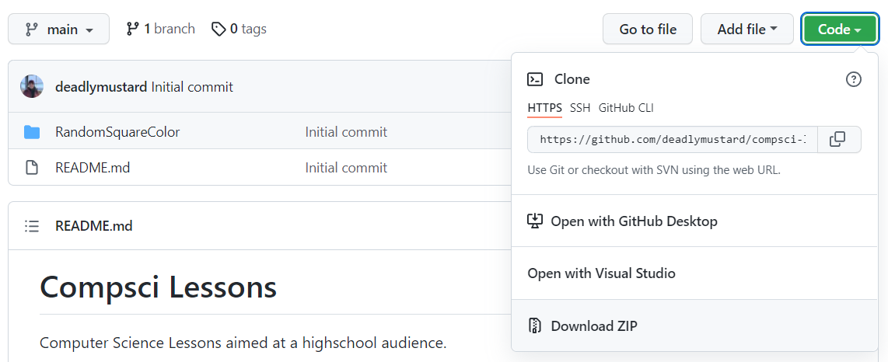

# Compsci Lessons
Computer Science Lessons aimed at a highschool audience.

## Using These Lessons
### Requirements
- Visual Studio Code (https://code.visualstudio.com/)

## Downloading These Lessons
### Git Clone (Recommended)
There are two way to get these lessons. The recommended way is to use the git command line tool to clone (aka download) this repository on your computer. To do this, you'll want to start by installing the git command line utility: https://git-scm.com/. It may also be helpful to install an IDE like Visual Studio Code (https://code.visualstudio.com/).

1. Download and install Visual Studio Code
2. Download and install the git command line utility. You can use the default installation settings when installing git. Ensure that you restart Visual Studio Code before continuing to the next step.
3. Open Visual Studio Code and navigate to the directory you would like to clone this project to.
4. In Visual Studio Code, navigate to the top toolbar and go to Terminal -> New Terminal. You should see a terminal window open at the bottom of the screen.
5. In the terminal window type `git clone https://github.com/deadlymustard/compsci-lessons.git` and press Enter.
6. The project should now be loaded onto your computer.

### Download Zip
Navigate to the `Code` button in Github and click on it. You should see the following dropdown:

Once here, you can download `.zip` file of this project and extract it to the location of your choosing on your computer.

## Web Development Excercises
RandomSquareColor - Learn how to create a square with HTML/CSS and write Javascript to manipulate its color.v